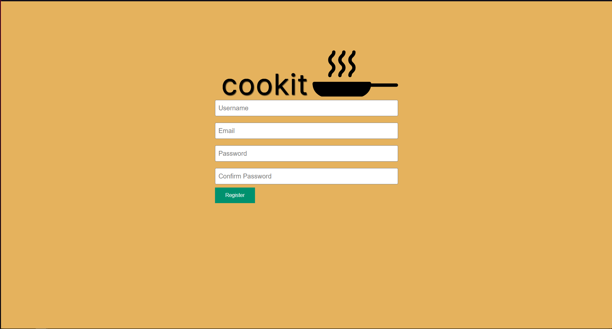
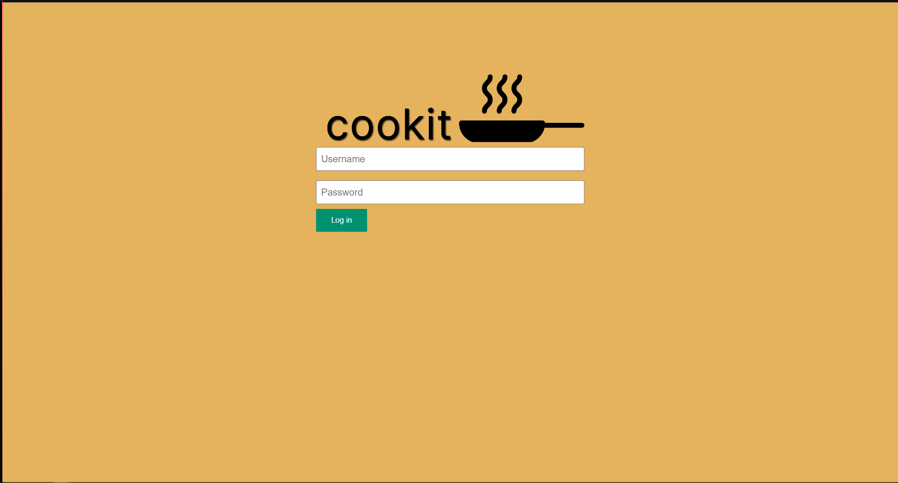
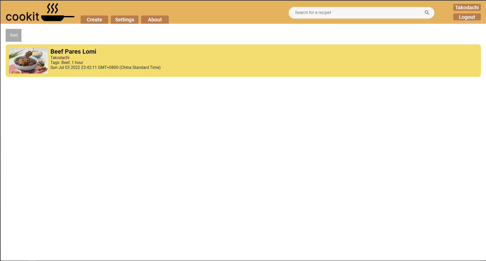
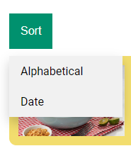
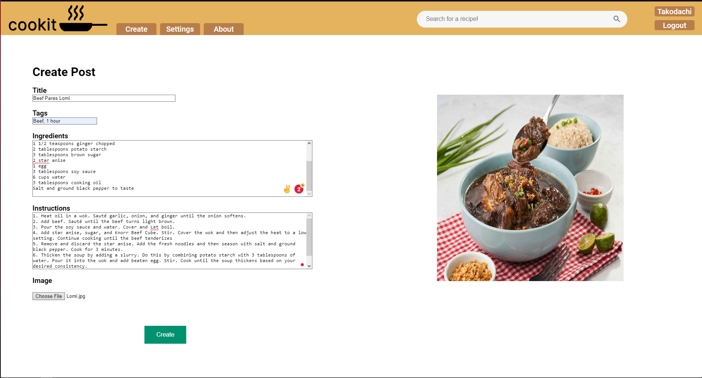
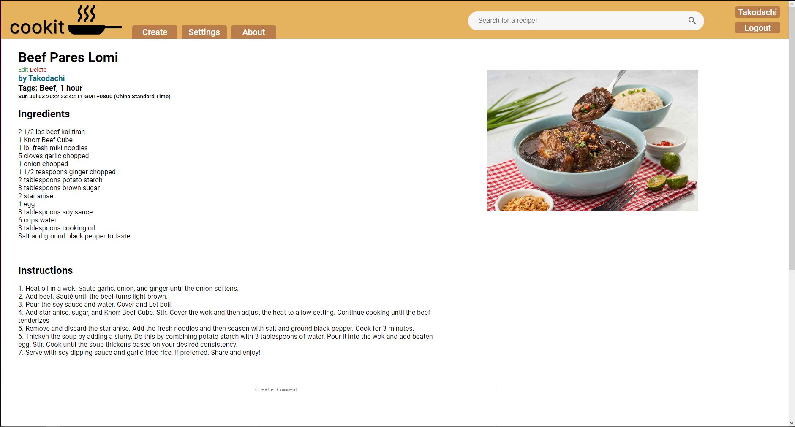
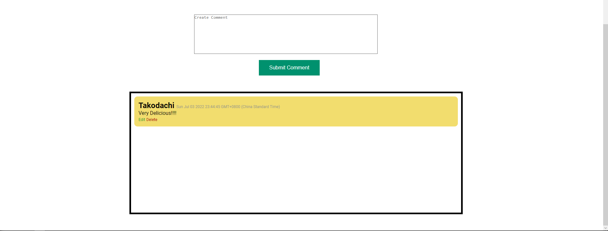
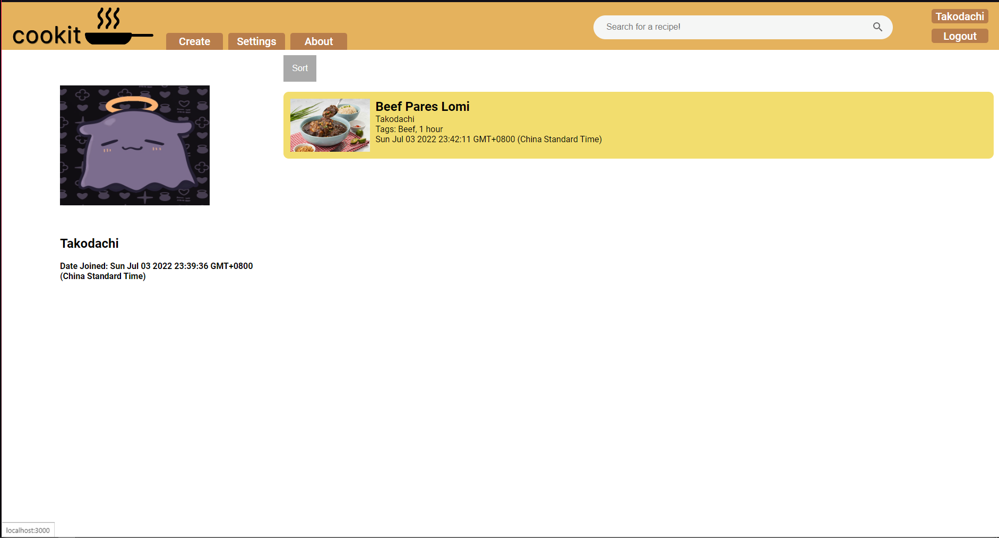
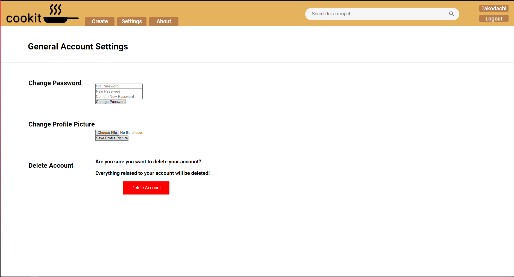

# cookit, recipes made easy!

cookit is a recipe-sharing site where anyone can share their dishes no matter what cuisine!

You can either run the project locally, or open it using this link: [https://cookit-apdev.herokuapp.com](https://cookit-apdev.herokuapp.com)


## Features
* **Register & Log in** - Before being able to create, share, and comment on recipes, create your own account and login!
* **Create & Edit Recipe Posts** - Share your recipes on the site! Put in the ingredients, instructions, and upload a photo of your dish.
* **Create & Edit Comments on Posts** - Want to tell someone how delicious their recipe is? Comment on their post!
* **View All Recipes** - Can't decide on what to cook? View all the recipes on the site in one page.
* **Search Recipes or Tags** - Want to search for a pork dish, or a Japanese dish? Use the search bar to search for recipes and tags!
* **Delete Posts, Comments, and your Account** - Have control over your data. Delete your posts, comments, and even your account.

## Software Dependencies
* Any text editor
* [NodeJS & npm](https://nodejs.org/en/download/)
* [MongoDB Community Server](https://www.mongodb.com/try/download/community)
* [MongoDB Compass (Optional)](https://www.mongodb.com/try/download/compass)


## Local setup
1. Clone the repository to your machine.
  ```shell
  git clone https://github.com/TimPin28/cookit
  ```
2. Navigate to the directory where forked the local copy of cookit.
  ```shell
  cd cookit
  ```
3. Install the dependencies in package.json. All needed packages are already included.
  ```shell
  npm install
  ```
4. Run the server by inputting the script below on your terminal:
  ```shell
  node index.js
  ```
5. Navigate to [http://localhost:3000](http://localhost:3000). This should this display the home page of cookit.


#### Note
The application will initially be without any entries since your database is not yet populated.

## How to Use cookit
First, create an account by clicking on "Register" on the top-right of the page.

### Creating a cookit account
Enter a username, email, and password. Make sure that the passwords in both fields are the same, and are at least 6 characters in length.<br />


If your account was successfully created, you will be redirected to the login page. Login with the username and password you entered earlier.<br />


### The home page
Here, you'll see all the recipes currently posted on the site. You can use the search bar in the header to look for recipes based on their name or tags.<br />


By default, all posts are sorted by how recently they were added. If you want to sort by alphabetical order, hover over sort and click on "Alphabetical".<br />


### Creating a recipe post
Enter a title for your recipe post, some tags (i.e. what cuisine it is, what kind of ingredients are in it, etc.), the ingredients, instructions, and an image of your dish. Press "Create" at the bottom to create the recipe post!<br />


You'll be redirected to your newly created recipe post! You can edit or delete it using the buttons under the recipe title. Note that you have to be logged in to do these actions. If you want to edit your post, it'll be the same interface as creating one.<br />


You and other cookit users may comment on any post on the site. You may also edit and delete your own comments.<br />


### Viewing user profiles
If you want to view your own profile, make sure you are logged in and click on the button with your username at the top-right of the page. Here, you'll see your profile picture, username, the date you joined on, and your submitted posts.<br />


To view other cookit users' profiles, just click on their usernames when you view their recipe posts.

### User settings
If you want to change your password, your profile picture, or delete your account all together, these options are available when you click on the "Settings" button in the header. <br />
If you decide to delete your account, all your comments and posts will automatically be deleted as well.<br />

