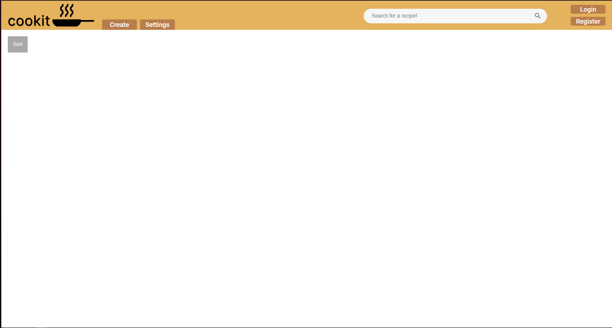

# cookit, Recipes made easy!

This website is a repository of recipes that have been made by our users!

You can either download the code, or open it using this link: [https://cookit-apdev.herokuapp.com](https://cookit-apdev.herokuapp.com)

## Local setup
1. Fork this repository to create a copy on your GitHub account.
2. Clone the forked repository to your machine.
  ```shell
  git clone https://github.com/TimPin28/APDEV
  ```
3. Navigate to the directory where forked the local copy of APDEV.
  ```shell
  cd APDEV
  ```
4. Install the dependencies in package.json. All needed packages are already included.
  ```shell
  npm install
  ```
5. Run the server by inputting the script below on your terminal:
  ```shell
  node index.js
  ```
6. Navigate to [http://localhost:3000](http://localhost:3000). This should this display the home page of cookit.


#### Note
The application will initially be without any entries since your database is not yet populated.
